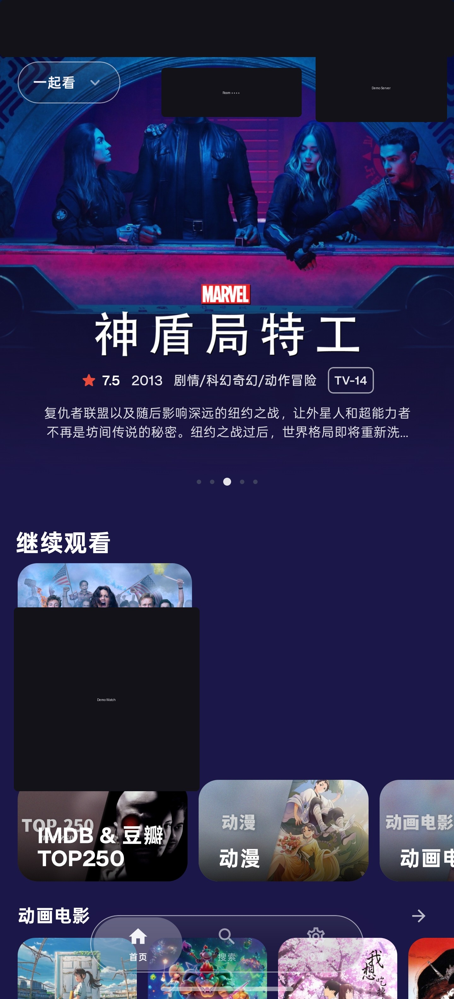
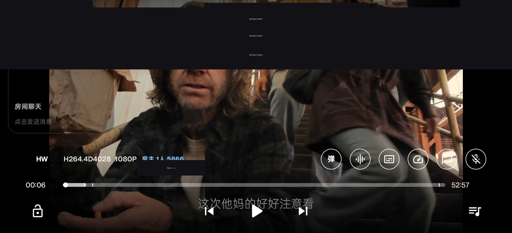
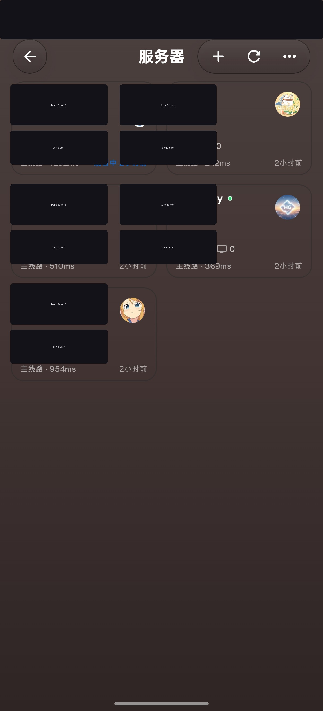

# Grmemby

[English](README.md) | **简体中文**

Grmemby 是一个开源的 Android 媒体客户端，适用于 Jellyfin/Emby 兼容服务器。项目使用 Kotlin 和 Jetpack Compose 构建，重点关注流畅的手机端体验、稳定播放、服务器管理，以及便携的数据导入/导出能力。

本项目是基于 JellyCine 的 GPLv3 分支/重构版本，加入了 Grmemby 品牌、播放修复、服务器管理、S 码迁移、一起看、界面体验等调整。

## 界面展示

<p align="center">
  
  
  
</p>

> 上方展示图已使用演示标签替换/遮挡服务器名、用户名、房间号等私有界面信息。

## 功能特性

- 支持 Jellyfin/Emby 兼容服务器登录与切换
- 包含手机端和 Android TV 模块
- 使用 Jetpack Compose + Material 3 构建界面
- 基于 Media3 ExoPlayer 播放，并保留 MPV/libmpv 集成路径
- 支持服务器管理、线路配置和保活工具
- 支持通过本地备份文件或 S 码文本进行数据导入/导出
- 仅在用户明确勾选时，才会备份/恢复本地登录凭据
- 包含搜索、详情页、设置、缓存控制、弹幕控制和一起看支持
- 包含 EMOS/路由感知播放修复和服务器图标匹配逻辑

## 项目结构

- `phone` — 主要 Android 手机端 App 模块
- `tv` — Android TV 模块
- `data` — API、仓库层、持久化、迁移/导入导出逻辑
- `core` — 播放器、偏好设置和通用逻辑
- `shared` — 共享 UI 和图片工具
- `room-server` — 一起看房间服务器模块
- `win-player` — 桌面端/MPV 辅助模块
- `docs` — 来自上游项目的文档资源

## 环境要求

- JDK 17
- Android Studio，或可用的 Android SDK/Gradle 环境
- 与 Gradle 文件中 `compileSdk` 匹配的 Android SDK Platform

## 构建

构建手机端 Debug APK：

```bash
./gradlew :phone:assembleDebug
```

构建手机端 Optimized APK：

```bash
./gradlew :phone:assembleOptimized
```

Release 签名可以通过 `keystore.properties` 或以下环境变量配置：

- `GRMEMBY_STORE_FILE`
- `GRMEMBY_STORE_PASSWORD`
- `GRMEMBY_KEY_ALIAS`
- `GRMEMBY_KEY_PASSWORD`

`keystore.properties` 和 keystore 文件会被 git 忽略，不应提交到仓库。

### Termux/aarch64 说明

在 Termux/aarch64 环境中，Android Gradle Plugin 可能需要使用本机可执行的 `aapt2`。请不要把这种机器相关配置提交到源码中，而是在本地通过参数传入，例如：

```bash
./gradlew :phone:assembleOptimized \
  -Pandroid.aapt2FromMavenOverride=<path-to-aapt2>
```

## 隐私与安全

- 本地备份/S 码导出只有在用户明确选择“账号/密码”选项时，才会包含登录凭据。
- 不包含凭据的备份在导入后需要重新登录或重新验证。
- 请不要提交真实服务器地址、token、密码、API key、备份 JSON 或 S 码示例。

隐私政策见 [PRIVACY](PRIVACY)。

## 许可证

GPLv3。详见 [LICENSE](LICENSE)。
